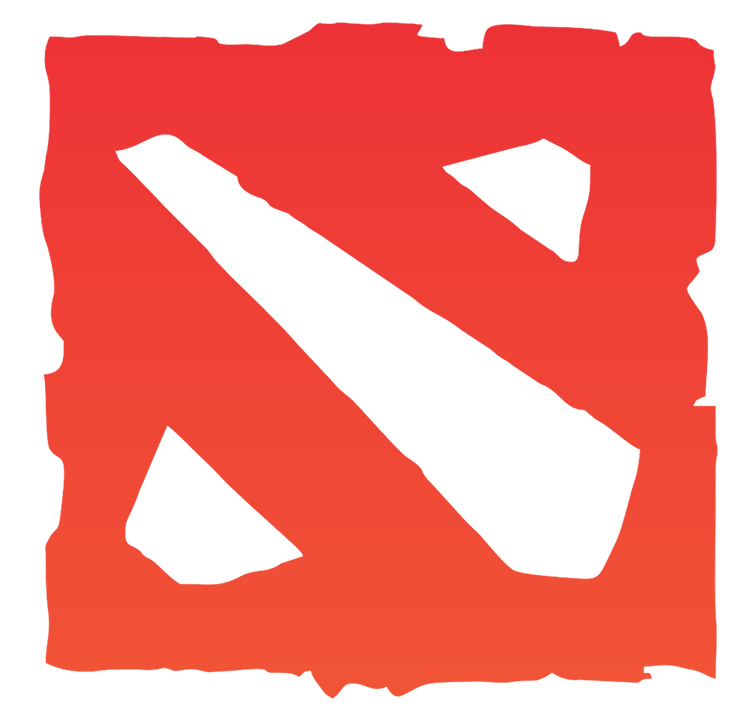

<!-- PROJECT LOGO -->
<br />
<p align="center">
  <a href="https://github.com/crbilladeau/dota-api">
    
  </a>

  <h2 align="center">Dota 2 App</h3>

  <p align="center">
    A simple React app that pulls and displays Dota 2 hero information from the Open Dota API and the Dota 2 website.
    <br />
    <br />
     
    <br />
  </p>
  <h2 align="center"><a href="https://crbilladeau.github.io/dota-api/#/">View Demo</a></h2>
  <br />
</p>


<!-- TABLE OF CONTENTS -->
<details open="open">
  <summary><h2 style="display: inline-block">Table of Contents</h2></summary>
  <ol>
    <li>
      <a href="#about-the-project">About The Project</a>
      <ul>
        <li><a href="#in-development">In Development</a></li>
      </ul>
      <ul>
        <li><a href="#built-with">Built With</a></li>
      </ul>
    </li>
    <li>
      <a href="#getting-started">Getting Started</a>
      <ul>
        <li><a href="#prerequisites">Prerequisites</a></li>
        <li><a href="#installation">Installation</a></li>
      </ul>
    </li>
    <li><a href="#contributing">Contributing</a></li>
    <li><a href="#license">License</a></li>
    <li><a href="#contact">Contact</a></li>
  </ol>
</details>


<!-- ABOUT THE PROJECT -->
## About The Project

<div align="center">
   <div style="display: flex; align-items: flex-start;">
     
     
  </div>
</div>

A **React** app that consumes the **Open Dota API** and shows a list of Dota 2 heroes and information on each hero. Utilizes **React Router** to redirect to custom hero pages with information pulled from the API and Dota 2's website. Styled with **React Bootstrap** and **styled components**.

### In Development

* Working on pulling information from pro player statistics into hero pages

### Built With

* [React](https://reactjs.org/)
* [React Router](https://reactrouter.com/web/guides/quick-start)
* [axios](https://github.com/axios/axios)
* [Open Dota API](https://docs.opendota.com/)
* [React Bootstrap](https://react-bootstrap.github.io/)
* [styled components](https://styled-components.com/)


<!-- GETTING STARTED -->
## Getting Started

To get a local copy up and running follow these simple steps.

### Prerequisites

This is an example of how to list things you need to use the software and how to install them.
* npm
  ```sh
  npm install npm@latest -g
  ```

### Installation

1. Clone the repo
   ```sh
   git clone https://github.com/crbilladeau/dota-api.git
   ```
2. Install NPM packages
   ```sh
   npm install
   ```


<!-- CONTRIBUTING -->
## Contributing

1. Fork the Project
2. Create your Feature Branch (`git checkout -b feature/AmazingFeature`)
3. Commit your Changes (`git commit -m 'Add some AmazingFeature'`)
4. Push to the Branch (`git push origin feature/AmazingFeature`)
5. Open a Pull Request


<!-- CONTACT -->
## Contact

Your Name - [@crbilladeau](https://twitter.com/crbilladeau) - charlie.billadeau@gmail.com

Project Link: [https://github.com/crbilladeau/dota-api](https://github.com/crbilladeau/dota-api)

